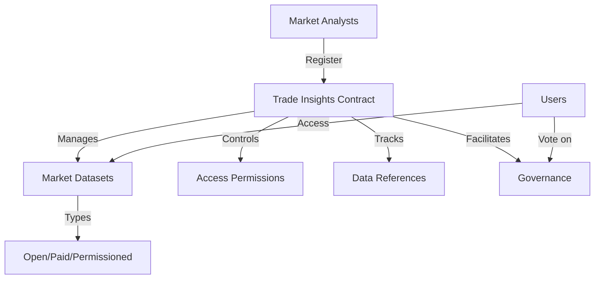

# Analyze Trade: Market Intelligence Platform

A decentralized platform for trade data analysis, enabling secure storage, validation, and access control of critical market-related insights and trade information.

## Overview

Analyze Trade is a blockchain-based platform that serves market researchers, traders, and analysts by providing:
- Immutable storage of trade and market research data
- Verifiable data attribution and source tracking
- Flexible access control mechanisms
- Governance system for community-driven insights
- Monetization options for valuable market data

The platform connects traders, analysts, and market researchers in a trustless environment where data integrity and proper attribution are guaranteed by blockchain technology.

## Architecture

The system is built around a primary smart contract that manages:



### Core Components:
- Analyst Registry
- Market Dataset Management
- Access Control System
- Data Reference Tracking
- Governance Mechanism

## Contract Documentation

### trade-insights.clar

The main contract handling all core functionality of the Analyze Trade platform.

#### Key Features:
- Analyst registration and verification
- Market dataset registration and metadata storage
- Flexible access control (Open, Paid, Permissioned)
- Reference tracking and attribution
- Governance proposal system

#### Access Types:
- `ACCESS-TYPE-OPEN` (u1): Freely accessible data
- `ACCESS-TYPE-PAID` (u2): Requires payment for access
- `ACCESS-TYPE-PERMISSIONED` (u3): Requires explicit permission

## Getting Started

### Prerequisites
- Clarinet
- Stacks wallet for deployment/interaction

### Basic Usage

1. Register as a market analyst:
```clarity
(contract-call? .trade-insights register-analyst "Jane Smith" "Global Market Research" "Senior Market Analyst")
```

2. Register a market dataset:
```clarity
(contract-call? .trade-insights register-dataset 
    "dataset-001"
    "Global Trade Trends 2023"
    "Economic Indicators"
    "International Markets"
    u1683849600
    "Comprehensive market trend analysis"
    0x... ;; data hash
    u1    ;; open access
    u0    ;; free
)
```

3. Access a dataset:
```clarity
(contract-call? .trade-insights check-dataset-access "dataset-001" tx-sender)
```

## Function Reference

### Public Functions

#### Analyst Management
- `register-analyst`: Register a new market analyst
- `get-analyst`: Retrieve analyst information

#### Dataset Management
- `register-dataset`: Register a new market dataset
- `verify-dataset`: Verify a dataset (admin only)
- `get-dataset`: Retrieve dataset information

#### Access Control
- `grant-dataset-access`: Grant access to permissioned dataset
- `access-paid-dataset`: Purchase access to paid dataset
- `check-dataset-access`: Check access permissions

#### References
- `reference-dataset`: Reference a dataset in research
- `get-reference`: Retrieve reference information

#### Governance
- `create-proposal`: Create a governance proposal
- `vote-on-proposal`: Vote on active proposals
- `finalize-proposal`: Finalize proposal after voting period

## Development

### Testing
1. Clone the repository
2. Install Clarinet
3. Run tests:
```bash
clarinet test
```

### Local Development
1. Start Clarinet console:
```bash
clarinet console
```
2. Deploy contracts:
```clarity
(contract-call? .trade-insights ...)
```

## Security Considerations

### Access Control
- Only registered analysts can register datasets
- Dataset access is strictly controlled based on type
- Paid access requires successful STX transfer
- Permission grants only by dataset owners

### Governance
- Only registered analysts can participate
- Proposals have fixed voting periods
- Vote counting is transparent and immutable
- Status changes are permanent once finalized

### Limitations
- On-chain storage limited to metadata
- Actual dataset storage should be off-chain
- Access control applies to metadata only
- References must be by registered analysts